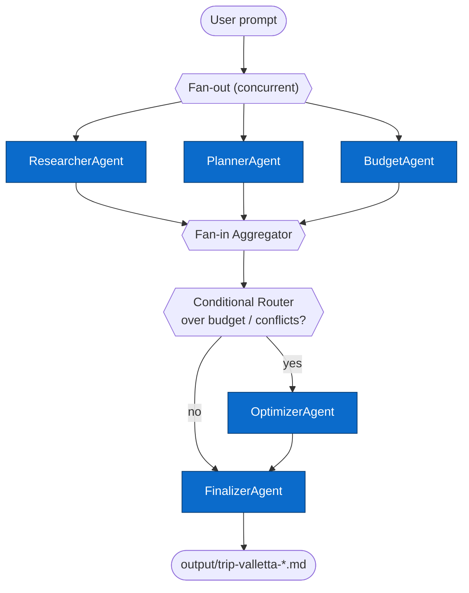

# Beyond a Single Agent — Trip Planner Demo

A Python multi-agent workflow that plans a personalised 3-day trip using **Azure AI Foundry Agent Service** and a concurrent + conditional orchestration pattern.

> **User prompt:** _"Plan my 3-day trip to Valletta in April with budget $2200"_

---

## How it works



Each agent is a **hosted PromptAgent** registered in Foundry Agent Service (visible in the Foundry UI under **Agents → My agents**). The Python workflow layer (`WorkflowBuilder`) orchestrates concurrent execution and conditional routing, and each specialist call is routed to its hosted agent by an **explicit `agent_name`**.

📐 **See [`docs/architecture.md`](docs/architecture.md)** for the full orchestration diagrams (fan-out/fan-in, explicit agent routing sequence) and a side-by-side mapping to the real Microsoft Agent Framework API.

---


## Prerequisites

| Tool | Version |
|---|---|
| Python | 3.11+ |
| Azure CLI | latest (`az --version`) |
| Azure subscription | Owner or Contributor access |

---

## Quick start — Azure AI Foundry

This project runs **entirely on Azure AI Foundry** — there is no offline/demo
mode. Both backends call the same Foundry project:

| `TRIP_BACKEND` | What it does |
|---|---|
| `foundry` *(default)* | Hosted multi-agent workflow — each specialist call is routed to its PromptAgent in Foundry Agent Service (via the Responses API). |
| `foundry_models` | Direct chat completions against the same Foundry model deployment (no hosted agents required). |

```bash
# 1. Clone and create virtual environment
git clone https://github.com/hkaanturgut/beyond-single-agent
cd beyond-single-agent
python3 -m venv .venv && source .venv/bin/activate

# 2. Install dependencies
pip install -r requirements.txt

# 3. Point at your Foundry project and sign in
cp .env.example .env         # set FOUNDRY_PROJECT_ENDPOINT
az login --tenant ffe3d4fb-2c1a-4bee-be2f-4b6e78f182c9
az account set --subscription fc4b39c5-adad-4de0-a91a-06dd08aa2e8f

# 4. Run (hosted multi-agent workflow — deploy agents first, see below)
python3 -m trip_planner "Plan my 3-day trip to Valletta in April with budget \$2200"

# ...or use direct model inference on the same Foundry (no hosted agents):
TRIP_BACKEND=foundry_models \
  python3 -m trip_planner "Plan my 3-day trip to Valletta in April with budget \$2200"
```

The output markdown is saved to `output/trip-valletta-<timestamp>.md`.

> First time? Follow **Full setup — Azure AI Foundry** below to provision the
> infrastructure and register the hosted agents.

---

## Full setup — Azure AI Foundry (production)

### Step 1: Azure login

```bash
az login --tenant ffe3d4fb-2c1a-4bee-be2f-4b6e78f182c9
az account set --subscription fc4b39c5-adad-4de0-a91a-06dd08aa2e8f
```

### Step 2: Deploy Azure infrastructure

The GitHub Actions workflow provisions all Azure resources (Foundry Hub, Project, AI Services, model deployment):

1. Go to **Actions → Deploy Azure infrastructure and agents → Run workflow**
2. Use defaults: region `eastus`, resource group `rg-beyond-single-agent`
3. Wait ~5 minutes for deployment to complete
4. Copy the `FOUNDRY_PROJECT_ENDPOINT` from the job summary

Or deploy from CLI:

```bash
az group create --name rg-beyond-single-agent --location eastus

az deployment group create \
  --resource-group rg-beyond-single-agent \
  --template-file infra/main.bicep \
  --parameters infra/main.parameters.bicepparam \
  developerPrincipalIds="[\"$(az ad signed-in-user show --query id -o tsv)\"]"
```

### Step 3: Grant yourself Foundry access

```bash
# Get your object ID
MY_OID=$(az ad signed-in-user show --query id -o tsv)
AI_SERVICES_NAME=$(az resource list --resource-group rg-beyond-single-agent \
  --query "[?kind=='AIServices'].name" -o tsv)

az role assignment create \
  --role "Azure AI Developer" \
  --assignee "$MY_OID" \
  --scope "/subscriptions/fc4b39c5-adad-4de0-a91a-06dd08aa2e8f/resourceGroups/rg-beyond-single-agent/providers/Microsoft.CognitiveServices/accounts/$AI_SERVICES_NAME"
```

> **Tip:** Pass your OID in `developerPrincipalIds` during deployment (Step 2) to skip this step.

### Step 4: Deploy the agents to Foundry

```bash
# Set your Foundry endpoint (from Step 2 output)
export FOUNDRY_PROJECT_ENDPOINT=https://trip-planner-prod.services.ai.azure.com/api/projects/trip-planner-prod

# Deploy all 5 agents to Foundry Agent Service
python3 scripts/deploy_agents.py
```

You should see:
```
=== Trip Planner — Foundry Agent Deployment ===

Connecting to Foundry project: https://...
  → Deploying researcher-agent ... v1 ✓
  → Deploying planner-agent ...    v1 ✓
  → Deploying budget-agent ...     v1 ✓
  → Deploying optimizer-agent ...  v1 ✓
  → Deploying finalizer-agent ...  v1 ✓

All agents deployed successfully.
View them in the Foundry UI: Agents → My agents
```

### Step 5: Run the trip planner with Foundry agents

```bash
# Configure .env
cp .env.example .env
# Set:
#   TRIP_BACKEND=foundry
#   FOUNDRY_PROJECT_ENDPOINT=https://trip-planner-prod.services.ai.azure.com/api/projects/trip-planner-prod

python3 -m trip_planner "Plan my 3-day trip to Valletta in April with budget \$2200"
```

---

## Environment variables

| Variable | Required for | Description |
|---|---|---|
| `TRIP_BACKEND` | always | `foundry` (default) \| `foundry_models` |
| `FOUNDRY_PROJECT_ENDPOINT` | always | `https://<resource>.services.ai.azure.com/api/projects/<project>` |
| `FOUNDRY_MODEL_NAME` | always | model deployment name, default `gpt-5-mini` |

---

## Repository layout

| Path | What it is |
|---|---|
| `src/trip_planner/` | Main Python package |
| `src/trip_planner/agents/` | Five specialist agents (researcher, planner, budget, optimizer, finalizer) |
| `src/trip_planner/backends/foundry_agents.py` | Foundry multi-agent backend — routes each call to the right hosted agent |
| `src/trip_planner/workflow/builder.py` | `WorkflowBuilder` + `ConcurrentBuilder` — concurrent fan-out and conditional routing |
| `scripts/deploy_agents.py` | Registers agents in Foundry Agent Service (run once after infra deploy) |
| `infra/` | Bicep templates — Foundry Hub, Project, AI Services, model, RBAC |
| `workflows/trip-planner-pipeline.yaml` | Human-readable workflow descriptor |
| `tests/` | Unit, integration, and contract tests |
| `output/` | Generated trip-brief markdown files (git-ignored) |
| `specs/001-trip-planner-demo/` | Spec, plan, tasks (spec-kit format) |

---

## Running tests

```bash
pip install -r requirements.txt
pytest tests/ -v
```

---

## Azure resources deployed

| Resource | Purpose |
|---|---|
| Foundry Hub | Workspace container for projects |
| Foundry Project | Agent Service project — hosts the 5 agents |
| AI Services account | Model endpoint (`gpt-5-mini`) |
| Log Analytics + App Insights | Observability and telemetry |
| Storage Account | Required backing store for Foundry |

---

## Troubleshooting

**"Unable to access your agents"** in Foundry UI  
→ You need the `Azure AI Developer` role on the AI Services account. Run Step 3 above.

**"FOUNDRY_PROJECT_ENDPOINT is not set"**  
→ This project is Foundry-only and will exit with a clear error if the endpoint is missing. Copy the endpoint from the GitHub Actions job summary or run `az deployment group show`, then set `FOUNDRY_PROJECT_ENDPOINT` in `.env`.

**Hosted agents not found (`TRIP_BACKEND=foundry`)**  
→ Register them once with `python scripts/deploy_agents.py`, or use `TRIP_BACKEND=foundry_models` to call the Foundry model directly without hosted agents.

**Model deployment quota issues**  
→ `gpt-5-mini` with `GlobalStandard` SKU is used. If quota is exceeded, change `modelDeploymentName` in `infra/main.parameters.bicepparam` to a model available in your subscription.

| `talks/python-toronto/` | Python Toronto-focused talk narrative |
| `demos/trip_planner/` | Sample invocations |
| `.specify/` | Spec Kit templates, scripts, and workflow metadata |
| `_archive/` | Previous placeholder implementation kept for reference |

## Tests

```bash
pytest tests/ -v
```

## Spec Kit workflow (completed)

This repo was built spec-first using GitHub Spec Kit.

```bash
uvx --from git+https://github.com/github/spec-kit.git specify init --here --integration copilot --force
```

| Artifact | Path |
|---|---|
| Specification (WHAT/WHY) | [`specs/001-trip-planner-demo/spec.md`](specs/001-trip-planner-demo/spec.md) |
| Implementation plan (HOW) | [`specs/001-trip-planner-demo/plan.md`](specs/001-trip-planner-demo/plan.md) |
| Ordered task breakdown | [`specs/001-trip-planner-demo/tasks.md`](specs/001-trip-planner-demo/tasks.md) |
| Quickstart / runbook | [`specs/001-trip-planner-demo/quickstart.md`](specs/001-trip-planner-demo/quickstart.md) |

## Operational notes

- **No secrets in source control** — all credentials are read from environment variables.
- **Route decisions are logged** — watch for `route decision: optimize/finalize` in stdout.
- **Non-fatal errors are tolerated** — a backend timeout does not crash the workflow;
  affected specialist outputs fall back to safe defaults.
- **Output files are timestamped** — each run produces a new file; old files are not overwritten.
- **Bicep infra** — see [`infra/README.md`](infra/README.md) for production deployment instructions.
