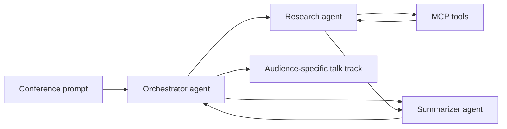

# Beyond a Single Agent

One demo codebase, two talks, one message: **a single LLM call is not the same thing as a reliable multi-agent system**.

This repository supports:

- [Malta Microsoft AI User Group](talks/malta/README.md) — a platform-focused deep dive into Azure AI Foundry visual orchestration, YAML workflows, MCP tools, and production deployment.
- [Python Toronto](talks/python-toronto/README.md) — a Python-first walkthrough of how to build multi-agent workflows with small, readable components instead of one overloaded agent.

## What this repo demonstrates

1. A **single-agent failure mode** where one prompt tries to do routing, retrieval, synthesis, and audience adaptation all at once.
2. A **multi-agent win** where an orchestrator delegates research and summarization to focused agents.
3. A **Foundry-ready shape** using `azure-ai-projects`, `DefaultAzureCredential`, a reusable YAML workflow, and MCP-style tool wrappers.

## Repo map

| Area | Purpose | Best for |
| --- | --- | --- |
| [`agents/`](agents/) | Orchestrator and domain agents | Python Toronto |
| [`tools/mcp_tools.py`](tools/mcp_tools.py) | MCP-style search and lookup wrappers | Both talks |
| [`workflows/pipeline.yaml`](workflows/pipeline.yaml) | Reviewable orchestration-as-code template | Malta |
| [`demos/single_agent_fail/`](demos/single_agent_fail/) | Show why one agent breaks down | Both talks |
| [`demos/multi_agent_win/`](demos/multi_agent_win/) | Show the orchestrated version | Both talks |
| [`talks/malta/`](talks/malta/) | Malta narrative and demo beats | Malta |
| [`talks/python-toronto/`](talks/python-toronto/) | Python Toronto narrative and code tour | Python Toronto |

## Architecture



The orchestrator keeps the audience and task plan in scope, the research agent gathers evidence, and the summarizer turns structured findings into a narrative that fits the room.

## Quick start

```bash
python -m venv .venv
source .venv/bin/activate
pip install -r requirements.txt
cp .env.example .env
python demos/single_agent_fail/demo.py
python demos/multi_agent_win/demo.py --audience python-toronto
python demos/multi_agent_win/demo.py --audience malta
```

## Optional live Azure AI Foundry mode

The repo runs in **local simulation mode** by default so you can demo it without cloud credentials. To wire it to a real Foundry project:

1. Populate `.env` from `.env.example`.
2. Sign in with `az login` or provide a service principal for `DefaultAzureCredential`.
3. Run `python demos/multi_agent_win/demo.py --audience malta --live`.

When live mode is enabled, the orchestrator uses the official Foundry SDK pattern:

- `AIProjectClient(endpoint=..., credential=DefaultAzureCredential())`
- `project_client.get_openai_client()`
- `openai_client.responses.create(model=..., input=...)`

## Suggested demo flow

1. Start with [`demos/single_agent_fail/demo.py`](demos/single_agent_fail/demo.py) to show why one agent becomes fragile.
2. Switch to [`demos/multi_agent_win/demo.py`](demos/multi_agent_win/demo.py) to show delegation and structured handoffs.
3. Open [`workflows/pipeline.yaml`](workflows/pipeline.yaml) to connect the Python implementation to Foundry orchestration and production concerns.

## Why this framing works for both talks

- **Malta:** the same code becomes a story about orchestration surfaces, tool contracts, and deployment discipline.
- **Python Toronto:** the same code becomes a story about clean Python modules, explicit responsibilities, and simple composition.

