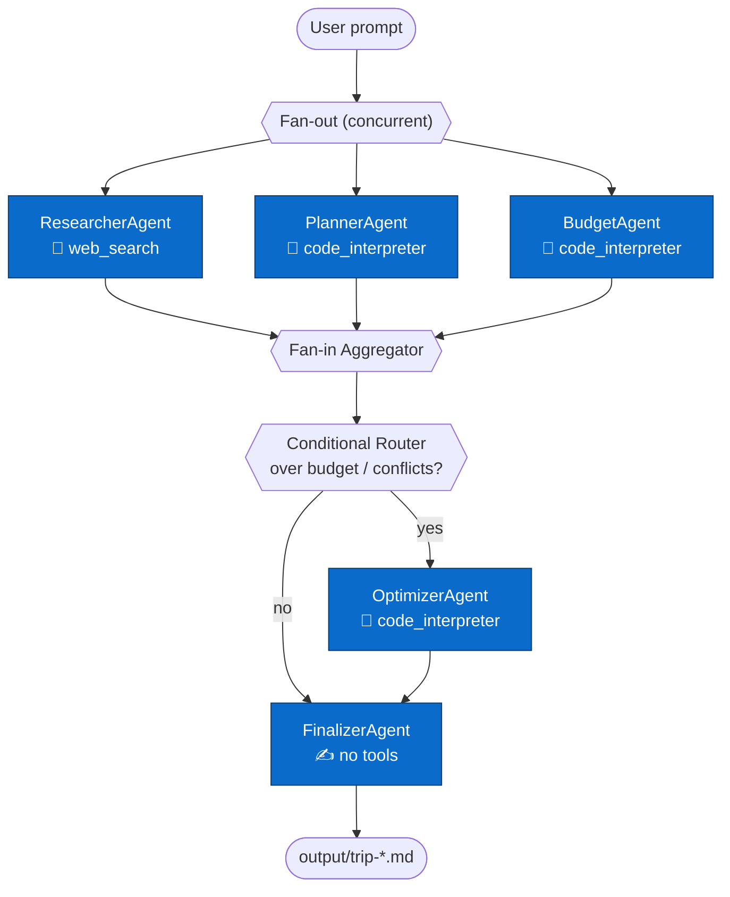

# Beyond a Single Agent — Trip Planner Demo

A Python multi-agent workflow that plans a personalised 3-day trip using **Azure AI Foundry Agent Service** and a concurrent + conditional orchestration pattern.

> **User prompt:** _"Plan my 3-day trip to Valletta in April with budget $2200"_

---

## How it works



Each agent is a **hosted PromptAgent** registered in Foundry Agent Service (visible in the Foundry UI under **Agents → My agents**), and each one is deployed **with the tools it actually needs** — that's what makes them genuine specialists rather than prompt variants. The Python workflow layer (`WorkflowBuilder`) orchestrates concurrent execution and conditional routing, and each specialist call is routed to its hosted agent by an **explicit `agent_name`**.

### Agent capabilities (tools)

| Agent | Tool | Why it needs a real capability |
|-------|------|--------------------------------|
| **researcher-agent** | 🔎 `web_search` (+ optional MCP) | Grounds attractions, seasonal weather, and events in **current** web data instead of stale training data. |
| **planner-agent** | 🧮 `code_interpreter` | Sequences time slots and **detects scheduling overlaps programmatically**. |
| **budget-agent** | 🧮 `code_interpreter` | Computes cost totals with **exact arithmetic** (LLMs miscount). |
| **optimizer-agent** | 🧮 `code_interpreter` | **Recomputes** the revised budget so the new total truly hits the target. |
| **finalizer-agent** | ✍️ *(none)* | Deliberate contrast — pure synthesis into a markdown brief needs no tool. |

`web_search` and `code_interpreter` are **Foundry-hosted** tools that run inside Foundry's tool loop when the agent is invoked — they need **no** billable "Grounding with Bing Search" resource and no client-side plumbing (they work on pay-as-you-go). An optional **remote MCP server** can be attached to the researcher via `MCP_SERVER_URL` (see [`.env.example`](.env.example)).

📐 **See [`docs/architecture.md`](docs/architecture.md)** for the full orchestration diagrams (fan-out/fan-in, explicit agent routing sequence) and a side-by-side mapping to the real Microsoft Agent Framework API.

---


## Prerequisites

| Tool | Version |
|---|---|
| Python | 3.11+ |
| Azure CLI | latest (`az --version`) |
| Azure subscription | Owner or Contributor access |

---

## Quick start — Azure AI Foundry

This project runs **entirely on Azure AI Foundry** — there is no offline/demo
mode. Both backends call the same Foundry project:

| `TRIP_BACKEND` | What it does |
|---|---|
| `foundry` *(default)* | Hosted multi-agent workflow — each specialist call is routed to its PromptAgent in Foundry Agent Service (via the Responses API). |
| `foundry_models` | Direct chat completions against the same Foundry model deployment (no hosted agents required). |

```bash
# 1. Clone and create virtual environment
git clone https://github.com/hkaanturgut/beyond-single-agent
cd beyond-single-agent
python3 -m venv .venv && source .venv/bin/activate

# 2. Install dependencies
pip install -r requirements.txt

# 3. Point at your Foundry project and sign in
cp .env.example .env         # FOUNDRY_PROJECT_ENDPOINT is filled in during setup (Step 3 below)
az login                     # add --tenant <your-tenant-id> if you have multiple tenants
az account set --subscription <your-subscription-id>

# 4. Run (hosted multi-agent workflow — deploy agents first, see below)
python3 -m trip_planner "Plan my 3-day trip to Valletta in April with budget \$2200"

# ...or use direct model inference on the same Foundry (no hosted agents):
TRIP_BACKEND=foundry_models \
  python3 -m trip_planner "Plan my 3-day trip to Valletta in April with budget \$2200"
```

The output markdown is saved to `output/trip-valletta-<timestamp>.md`.

> First time? Follow **Full setup — Azure AI Foundry** below to provision the
> infrastructure and register the hosted agents.

---

## Full setup — Azure AI Foundry (production)

> **No hardcoded values.** Every command below reads from shell/`.env`
> variables, and the Foundry endpoint is captured straight from your deployment
> outputs into `.env`. You can deploy under any resource group / account name and
> the demo will pick up the right values automatically.

### Step 0: Set your deployment variables

```bash
# Change these freely — the rest of the guide reuses them.
export RG=rg-beyond-single-agent
export LOCATION=eastus
```

### Step 1: Azure login

```bash
az login                                       # add --tenant <your-tenant-id> if needed
az account set --subscription <your-subscription-id>
```

### Step 2: Deploy Azure infrastructure

The Bicep template provisions all Azure resources (Foundry account, Project,
model deployment, App Insights, Log Analytics) and grants you the
`Azure AI Developer` role via `developerPrincipalIds`:

```bash
az group create --name "$RG" --location "$LOCATION"

az deployment group create \
  --resource-group "$RG" \
  --name main \
  --template-file infra/main.bicep \
  --parameters infra/main.parameters.bicepparam \
  developerPrincipalIds="[\"$(az ad signed-in-user show --query id -o tsv)\"]"
```

> Prefer CI? Go to **Actions → Deploy Azure infrastructure and agents → Run
> workflow** instead — it runs the same template.

### Step 3: Capture deployment outputs into `.env`

This is the key step that keeps everything dynamic — it reads the **actual**
endpoint your deployment produced (whatever the resource was named) and writes
it to `.env`, so no value is ever hardcoded:

```bash
FOUNDRY_PROJECT_ENDPOINT=$(az deployment group show \
  --resource-group "$RG" --name main \
  --query properties.outputs.foundryProjectEndpoint.value -o tsv)

cat > .env <<EOF
TRIP_BACKEND=foundry
FOUNDRY_PROJECT_ENDPOINT=$FOUNDRY_PROJECT_ENDPOINT
FOUNDRY_MODEL_NAME=gpt-5-mini
EOF

echo "Wrote .env:" && cat .env
```

Both `scripts/deploy_agents.py` and `python3 -m trip_planner` load `.env`
automatically, so you never pass the endpoint on the command line again.

### Step 4: Deploy the agents to Foundry

```bash
# Reads FOUNDRY_PROJECT_ENDPOINT from .env — no export needed.
python3 scripts/deploy_agents.py
```

You should see:
```
=== Trip Planner — Foundry Agent Deployment (with tools) ===

Connecting to Foundry project: https://...
  → Deploying researcher-agent  [tools: web_search] ... v1 ✓
  → Deploying planner-agent  [tools: code_interpreter] ... v1 ✓
  → Deploying budget-agent  [tools: code_interpreter] ... v1 ✓
  → Deploying optimizer-agent  [tools: code_interpreter] ... v1 ✓
  → Deploying finalizer-agent  [tools: none] ... v1 ✓

All agents deployed successfully.
View them in the Foundry UI: Agents → My agents (each shows its attached tools).
```

### Step 5: Run the trip planner with Foundry agents

```bash
# All config comes from .env (written in Step 3).
python3 -m trip_planner "Plan my 3-day trip to Valletta in April with budget \$2200"
```

The output markdown is saved to `output/trip-valletta-<timestamp>.md`.

### Step 6: Tear down everything

When you're done, delete the resource group to remove **all** deployed
resources (Foundry account, project, model deployment, App Insights, Log
Analytics) in one shot:

```bash
az group delete --name "$RG" --yes --no-wait
rm -f .env          # optional: clear the captured endpoint
```

> `--no-wait` returns immediately; the deletion continues in the background.
> Verify later with `az group exists --name "$RG"` (prints `false` once gone).

> **Testing from scratch repeatedly?** AI Services accounts are *soft-deleted*
> and keep holding your model quota until purged. If a later deployment fails on
> quota, purge the soft-deleted account:
>
> ```bash
> az cognitiveservices account list-deleted \
>   --query "[].{name:name, location:location, rg:resourceGroup}" -o table
> az cognitiveservices account purge \
>   --name <deleted-account-name> --location "$LOCATION" --resource-group "$RG"
> ```

---

## Environment variables

| Variable | Required for | Description |
|---|---|---|
| `TRIP_BACKEND` | always | `foundry` (default) \| `foundry_models` |
| `FOUNDRY_PROJECT_ENDPOINT` | always | `https://<resource>.services.ai.azure.com/api/projects/<project>` |
| `FOUNDRY_MODEL_NAME` | always | model deployment name, default `gpt-5-mini` |

---

## Repository layout

| Path | What it is |
|---|---|
| `src/trip_planner/` | Main Python package |
| `src/trip_planner/agents/` | Five specialist agents (researcher, planner, budget, optimizer, finalizer) |
| `src/trip_planner/backends/foundry_agents.py` | Foundry multi-agent backend — routes each call to the right hosted agent |
| `src/trip_planner/workflow/builder.py` | `WorkflowBuilder` + `ConcurrentBuilder` — concurrent fan-out and conditional routing |
| `scripts/deploy_agents.py` | Registers agents in Foundry Agent Service (run once after infra deploy) |
| `infra/` | Bicep templates — Foundry Hub, Project, AI Services, model, RBAC |
| `workflows/trip-planner-pipeline.yaml` | Human-readable workflow descriptor |
| `tests/` | Unit, integration, and contract tests |
| `output/` | Generated trip-brief markdown files (git-ignored) |
| `specs/001-trip-planner-demo/` | Spec, plan, tasks (spec-kit format) |

---

## Running tests

```bash
pip install -r requirements.txt
pytest tests/ -v
```

---

## Azure resources deployed

| Resource | Purpose |
|---|---|
| Foundry Hub | Workspace container for projects |
| Foundry Project | Agent Service project — hosts the 5 agents |
| AI Services account | Model endpoint (`gpt-5-mini`) |
| Log Analytics + App Insights | Observability and telemetry |
| Storage Account | Required backing store for Foundry |

---

## Troubleshooting

**"Unable to access your agents"** in Foundry UI  
→ You need the `Azure AI Developer` role on the AI Services account. Step 2's
Bicep grants this to everyone in `developerPrincipalIds` (your own OID is passed
automatically). To grant a principal that wasn't included:

```bash
MY_OID=$(az ad signed-in-user show --query id -o tsv)
# Resolve the AI Services *account* id (filter by type — the child project also
# reports kind=AIServices and would otherwise return a second value)
AI_ACCOUNT_ID=$(az resource list --resource-group "$RG" \
  --query "[?type=='Microsoft.CognitiveServices/accounts'].id | [0]" -o tsv)

az role assignment create --role "Azure AI Developer" \
  --assignee "$MY_OID" --scope "$AI_ACCOUNT_ID"
```

**"FOUNDRY_PROJECT_ENDPOINT is not set"**  
→ This project is Foundry-only and exits with a clear error if the endpoint is
missing. Re-run **Step 3** to capture the endpoint from your deployment outputs
into `.env` (nothing is hardcoded — it reads the actual provisioned resource).

**Hosted agents not found (`TRIP_BACKEND=foundry`)**  
→ Register them once with `python scripts/deploy_agents.py`, or use `TRIP_BACKEND=foundry_models` to call the Foundry model directly without hosted agents.

**Model deployment quota issues**  
→ `gpt-5-mini` with `GlobalStandard` SKU is used. If quota is exceeded, change `modelDeploymentName` in `infra/main.parameters.bicepparam` to a model available in your subscription.

| `talks/python-toronto/` | Python Toronto-focused talk narrative |
| `demos/trip_planner/` | Sample invocations |
| `.specify/` | Spec Kit templates, scripts, and workflow metadata |
| `_archive/` | Previous placeholder implementation kept for reference |

## Tests

```bash
pytest tests/ -v
```

## Spec Kit workflow (completed)

This repo was built spec-first using GitHub Spec Kit.

```bash
uvx --from git+https://github.com/github/spec-kit.git specify init --here --integration copilot --force
```

| Artifact | Path |
|---|---|
| Specification (WHAT/WHY) | [`specs/001-trip-planner-demo/spec.md`](specs/001-trip-planner-demo/spec.md) |
| Implementation plan (HOW) | [`specs/001-trip-planner-demo/plan.md`](specs/001-trip-planner-demo/plan.md) |
| Ordered task breakdown | [`specs/001-trip-planner-demo/tasks.md`](specs/001-trip-planner-demo/tasks.md) |
| Quickstart / runbook | [`specs/001-trip-planner-demo/quickstart.md`](specs/001-trip-planner-demo/quickstart.md) |

## Operational notes

- **No secrets in source control** — all credentials are read from environment variables.
- **Route decisions are logged** — watch for `route decision: optimize/finalize` in stdout.
- **Non-fatal errors are tolerated** — a backend timeout does not crash the workflow;
  affected specialist outputs fall back to safe defaults.
- **Output files are timestamped** — each run produces a new file; old files are not overwritten.
- **Bicep infra** — see [`infra/README.md`](infra/README.md) for production deployment instructions.
