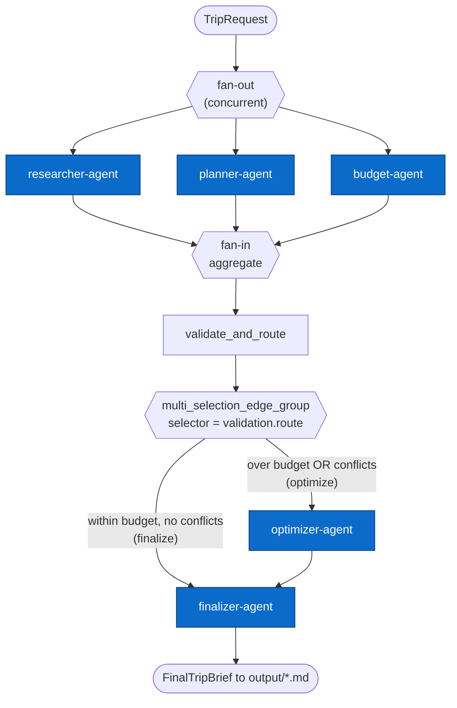
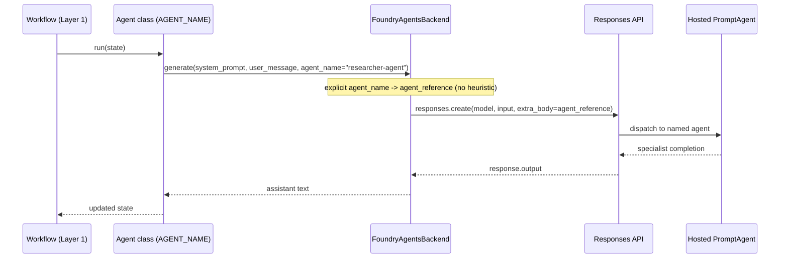

# Architecture — Multi-Agent Trip Planner

This document visualizes how the demo orchestrates five specialist agents into
one workflow, following the graph model of the
[Microsoft Agent Framework](https://learn.microsoft.com/agent-framework/overview/?pivots=programming-language-python).

There are **two routing layers**, and it's important to keep them separate:

1. **Workflow orchestration (Layer 1)** — the *shape* of the graph: concurrent
   fan-out, fan-in aggregation, and a conditional edge group. This is pure
   Python control flow (`src/trip_planner/workflow/`).
2. **Agent routing (Layer 2)** — which *hosted Foundry agent* each specialist
   call targets. Routing is now **explicit**: every agent passes its own
   `agent_name` (e.g. `"researcher-agent"`) to the backend, which dispatches
   the Responses API call to that exact PromptAgent.

---

## Layer 1 — Workflow orchestration

Researcher, Planner, and Budget run **concurrently** (fan-out). Their outputs
are aggregated into a single `TripProposal`, validated, and then routed: if the
plan is over budget or has scheduling conflicts it goes through the Optimizer
before the Finalizer; otherwise it goes straight to the Finalizer.



**Deterministic routing rule** (`workflow/router.py`):

| Condition                                   | Route      | Path                          |
|---------------------------------------------|------------|-------------------------------|
| `total_estimate > budget_usd`               | `optimize` | Optimizer -> Finalizer        |
| `itinerary.conflict_flags` is non-empty     | `optimize` | Optimizer -> Finalizer        |
| otherwise                                   | `finalize` | Finalizer only                |

The decision is made in code, not by an LLM, so the demo is reproducible on
stage.

---

## Layer 2 — Explicit agent routing to hosted Foundry agents

Each specialist agent class declares an `AGENT_NAME` constant and passes it to
`backend.generate(..., agent_name=AGENT_NAME)`. The `FoundryAgentsBackend`
uses that name directly to build the Responses API `agent_reference`, so the
call lands on the matching hosted PromptAgent visible in the Foundry UI. The
old keyword-matching heuristic remains only as a fallback for callers that
don't specify a name.



| Agent class       | `AGENT_NAME`       | Hosted agent (Foundry) |
|-------------------|--------------------|------------------------|
| `ResearcherAgent` | `researcher-agent` | researcher-agent       |
| `PlannerAgent`    | `planner-agent`    | planner-agent          |
| `BudgetAgent`     | `budget-agent`     | budget-agent           |
| `OptimizerAgent`  | `optimizer-agent`  | optimizer-agent        |
| `FinalizerAgent`  | `finalizer-agent`  | finalizer-agent        |

Agents are registered once with `scripts/deploy_agents.py`.

---

## Mapping to the real Microsoft Agent Framework

The demo ships a small, dependency-free builder in
`src/trip_planner/workflow/builder.py` so it runs on Python 3.9 (the version
pinned by CI and the deployed path). Its API mirrors the real
`agent_framework.WorkflowBuilder` one-to-one:

| This repo (local builder)                          | `agent_framework` (Python >= 3.10)            |
|----------------------------------------------------|-----------------------------------------------|
| `add_concurrent().add_task(...)`                   | `add_fan_out_edges(source, targets)`          |
| aggregate step                                     | `add_fan_in_edges(sources, target)`           |
| `add_step(name, fn)`                               | `add_edge(a, b)` / `add_chain([...])`         |
| `add_multi_selection_edge_group(name, selector, branches)` | `add_multi_selection_edge_group(source, targets, selection_func)` |
| `build()` / `workflow.run(state)`                  | `build()` / `workflow.run(message)`           |
| `BackendAdapter` + `agent_name`                    | `FoundryChatClient(...).as_agent(name=...)`   |

To adopt the real package on Python 3.10+:

```bash
pip install "agent-framework" "agent-framework-foundry"
```

Then wrap each specialist as a Foundry agent and reuse the same graph shape:

```python
from agent_framework import WorkflowBuilder
from agent_framework.foundry import FoundryChatClient
from azure.identity import AzureCliCredential

client = FoundryChatClient(
    project_endpoint=FOUNDRY_PROJECT_ENDPOINT,
    model=FOUNDRY_MODEL_NAME,
    credential=AzureCliCredential(),
)
researcher = client.as_agent(name="researcher-agent", instructions=RESEARCHER_SYSTEM)
# planner, budget, optimizer, finalizer ...

workflow = (
    WorkflowBuilder()
    .add_fan_out_edges(dispatch, [researcher, planner, budget])
    .add_fan_in_edges([researcher, planner, budget], aggregate)
    .add_edge(aggregate, validate)
    .add_multi_selection_edge_group(validate, [optimizer, finalizer], selection_func)
    .build()
)
```

Because Layer 1 is control-flow and Layer 2 is explicit `agent_name` routing,
the deployed Foundry agents are identical in both variants — only the
orchestration glue changes.
